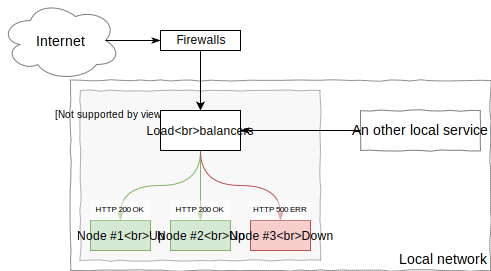

# HTTP Health checking for ASP.NET applications.

## Context

It is a common configuration to have the same HTTP application deployed on multiple nodes/servers with a load-balancer (or multiple load-balancers working together) doing some kind of round-robing (or sticky) distribution of HTTP requests.



 In that case, HTTP health checking is a way to detect down members so that the load that was previously handled but the faulting service instance is gracefully re-balanced to others instances. Do achieve this, the HTTP service can be reponsible of exposing an HTTP route that will indicates its current states using HTTP status-code.

- An HTTP 2xx generally means that the service is up and running.
- An HTTP 5xx is used to indicates that the service is unavailable.

The HTTP response may or may not comes with a content. Some load-balancers are designed to check for a specific response content like "Up" rather than checking the HTTP status-code.

## HttpHealthChecking project

This repository gives an example of a ASP.NET Core Middleware used to expose the status of the HTTP service to the load-balancer located upstream of the HTTP traffic.

Here is how you can configure Dependency Injection for your application:

```csharp
public void ConfigureServices (IServiceCollection services)
{
    services.AddHttpHealthService ();
    services.AddMvc ();
}
```

Then, you need to add the middleware to the requests pipeline.

```csharp
// By default, "/status" will be trap by the middleware.
app.UseHttpHealthCheck();
app.UseMvc();
```

Finally, when the application is initialized, just toggle the global switch and you're done.

```csharp
// The API is now fully initialized.
HttpHealthService.ToggleState(Health.Up);
```

### Read the current status

Obviously, it is possible to GET the current service status.

```
curl -X GET -i http://localhost:5000/status
```

### Rolling upgrade scenario, change current state

Unavailaibility is not necessary caused by issues on the current service. It can also means that a rolling upgrade of the service is ongoing on a specific instance. In that situation, if controlling your load-balancers through API is not possible, it can be interesting to be able to change the status of one specific instance.

To do that, the middleware supports PUT operation.

```
curl -X PUT -i http://localhost:5000/status --data Down
```

But to be able to toggle state, you need to configure an authorization filter.
Below is an example of the usage of JWT Token to secure the acces to the PUT operation.

```csharp
public void ConfigureServices (IServiceCollection services)
{
    // Get JWT token secret from configuration.
    string secret = Configuration.GetValue<string>("Secret");

    // Setting basic authorization layer.
    InMemoryAuthorizationRepository repository = new InMemoryAuthorizationRepository();
    repository.AddIdentity("1234567890");

    // IAuthorizationFilter services must be declared to allow to toggle state. 
    services.AddSingleton<IAuthorizationFilter>(new JwtAuthorizationFilter(repository, secret));

    services.AddHttpHealthService ();
    services.AddMvc ();
}
```

### Configure your own status route

The default route is /status. It can be configured in the Startup.cs file this way:

```csharp
public void ConfigureServices (IServiceCollection services)
{
    services.AddMvc();
    services.AddHttpHealthService("/myhealthcheckroute");
}
```
